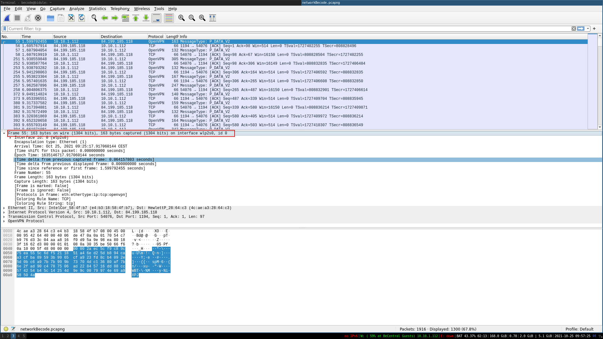
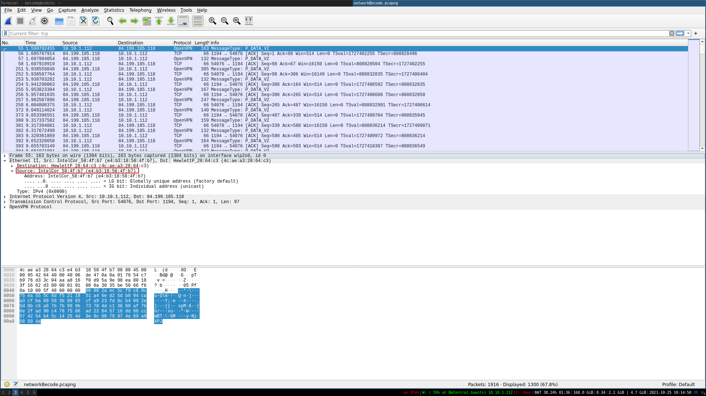
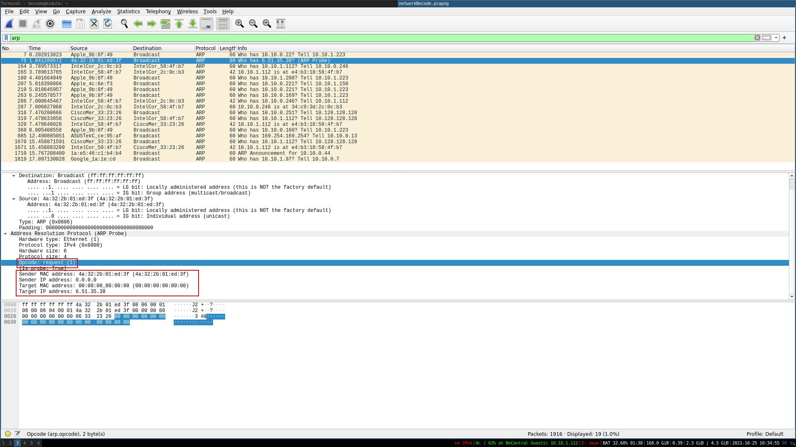
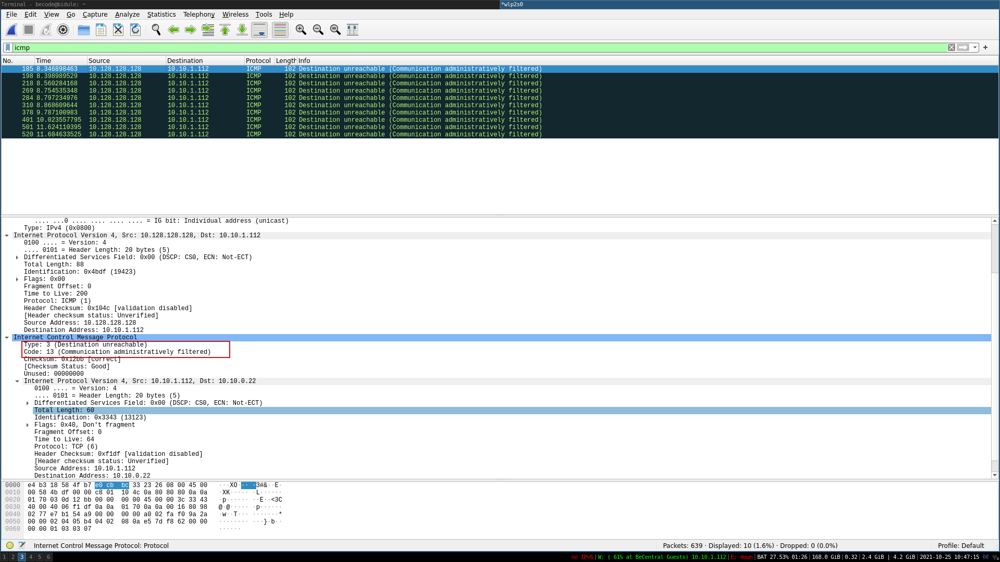
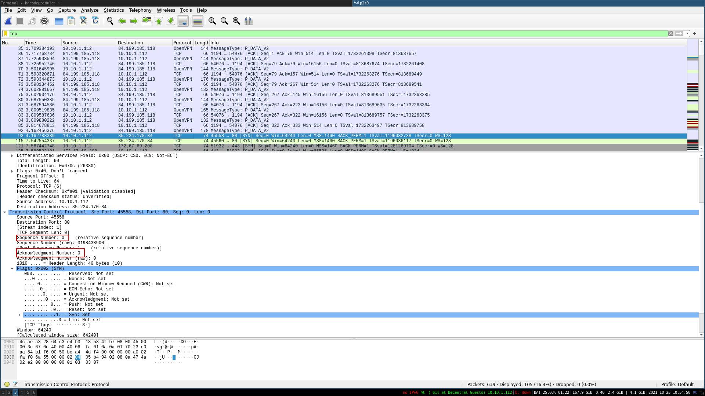
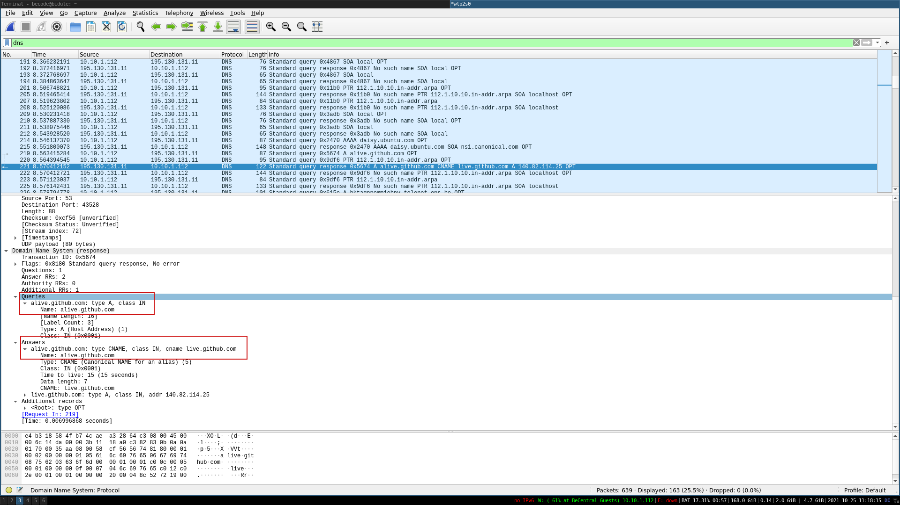

- What are the differences between the OSI model and the TCP/IP model?

```
OSI (theoretical model)

The OSI model (or Open Systems Interconnection Model) is an absolute fundamental model used in networking.  This critical model provides a framework dictating how all networked devices will send, receive and interpret data.

One of the main benefits of the OSI model is that devices can have different functions and designs on a network while communicating with other devices. Data sent across a network that follows the uniformity of the OSI model can be understood by other device.
 
Application
Presentation
Session
Transport
Network 
Link
Physical

- Each layer has a specific role to perform.
- Layers 1 to 4 are the network layers.
- The network layers provide the communication service to the application layer.
- Each layer is independent of the others.
- Each layer can only communicate with an adjacent layer.
- When sending data, the OSI model is traversed from top to bottom, crossing all layers.


TCP/IP (model in use)

This protocol is very similar to the OSI model. The TCP/IP protocol consists of four layers and is arguably just a summarised version of the OSI model. These layers are:


One defining feature of TCP is that it is connection-based, which means that TCP must establish a connection between both a client and a device acting as a server before data is sent.

The processes of encapsulation and de-encapsulation work in exactly the same way with the TCP/IP model as they do with the OSI model. At each layer of the TCP/IP model a header is added during encapsulation, and removed during de-encapsulation.
```
- How many layers do these two models have?

```
 OSI : 7 layers
 TCP/ip : 4 layers
```
- What do the acronyms TCP and IP refer to?

```
TCP (Transmission Control Protocol for short) 

IP (Internet Protocol)
```
- List the different layers of the TCP/IP model.

```
Application
Transport
Internet
Network Interface
```
- Give some examples of protocols and indicate which one of TCP/IP model layer they refer to.

```
  7 Application: HTTP, DNS, FTP  > Associated hardware : proxy. 
  6 Presentation: JPEG, SSL, SSH
  5 Session: NETBIOS
  4 Transport: TCP; UDP
    web server: Port 80 HTTP
    web server: Port 443 HTTPS
    mail servers: Port 25
  3 Network: IP, RIP, OSPF > Associated hardware: the router.
  2 Link: Ethernet > Associated hardware: switch.
  1 Physical: ADSL, bit in electrical signals > Associated material : the hub.

```
- Explain how a connection gets established, in other words, explain the "3-way handshake" process?

```
Three-way handshake - the term given for the process used to establish a connection between two devices. The Three-way handshake communicates using a few special messages - the table below highlights the main ones:


1	SYN	A SYN message is the initial packet sent by a client during the handshake. This packet is used to initiate a connection and synchronise the two devices together.
2	SYN/ACK	This packet is sent by the receiving device (server) to acknowledge the synchronisation attempt from the client.
3	ACK	The acknowledgement packet can be used by either the client or server to acknowledge that a series of messages/packets have been successfully received.
4	DATA	Once a connection has been established, data (such as bytes of a file) is sent via the "DATA" message.

```
- Explain how a connection is terminated, in other words, explain the "4-way disconnect" process?
```

5	FIN	This packet is used to cleanly (properly) close the connection after it has been complete.

- Local host sends FIN to remote host
- Remote host sends ACK for the previous message
- Remote host sends FIN to local host
- Local host sends ACK to remote host

6   RST	This packet abruptly ends all communication. This is the last resort and indicates there was some problem during the process. For example, if the service or application is not working correctly, or the system has faults such as low resources. 

```
- Explain what are the "sequence number" and "acknowledgment number" in TCP.
```
Sequence Numbers

All bytes in a TCP connection are numbered, beginning at a randomly chosen initial sequence number (ISN). The sequence number is the byte number of the first byte of data in the TCP packet sent (also called a TCP segment). The acknowledgement number is the sequence number of the next byte the receiver expects to receive. The receiver ack'ing sequence number x acknowledges receipt of all data bytes less than (but not including) byte number x.

The sequence number is always valid. The acknowledgement number is only valid when the ACK flag is one. The only time the ACK flag is not set, that is, the only time there is not a valid acknowledgement number in the TCP header, is during the first packet of connection set-up.
```
- What is the fundamental difference between TCP and UDP ?
```
TCP has built-in systems to check for errors and to guarantee data will be delivered in the order it was sent, making it the perfect protocol for transferring information like still images, data files, and web pages.

But while TCP is instinctively reliable, its feedback mechanisms also result in a larger overhead, translating to greater use of the available bandwidth on your network.

User Datagram Protocol (UDP) is a simpler, connectionless Internet protocol wherein error-checking and recovery services are not required. With UDP, there is no overhead for opening a connection, maintaining a connection, or terminating a connection; data is continuously sent to the recipient, whether or not they receive it. 

TCP is a connection-oriented protocol, whereas UDP is a connectionless protocol. A key difference between TCP and UDP is speed, as TCP is comparatively slower than UDP. Overall, UDP is a much faster, simpler, and efficient protocol, however, retransmission of lost data packets is only possible with TCP. 
```
- What are TCP ports? How many of them are they? What are the three main categories of TCP Ports (with there associated range)?

```
In computer networking, a port is a communication endpoint. At the software level, within an operating system, a port is a logical construct that identifies a specific process or a type of network service. A port is identified for each transport protocol and address combination by a 16-bit unsigned number, known as the port number. The most common transport protocols that use port numbers are the Transmission Control Protocol (TCP) and the User Datagram Protocol (UDP).

The Transmission Control Protocol (TCP) and the User Datagram Protocol (UDP) only need one port for duplex, bidirectional traffic. They usually use port numbers that match the services of the corresponding TCP or UDP implementation.

Well-known ports - 0 > 1023
Registered ports - 1023 > 49151
Dynamic, private or ephemeral ports - 49152 > 65535
```

- Provide three examples of well-know port numbers and tell to which Application layer protocol they refer to.
```
 Transport layer: TCP; UDP
    web server: Port 80 HTTP
    web server: Port 443 HTTPS
    mail servers: Port 25

```
- Explain the concept of TCP packets and how they are build over the layer flow.

```
When sending packets using TCP/IP, the data portion of each IP packet is formatted as a TCP segment.

Each TCP segment contains a header and data. The TCP header contains many more fields than the UDP header and can range in size from 202020 to 606060 bytes, depending on the size of the options field.

The TCP header shares some fields with the UDP header: source port number, destination port number, and checksum.

TCP packets need to be looked at as a whole to tell a story rather than one by one at the details.
```


# Tcpdump

 From my server capturing packets with TCPdump
 ```
sudo tcpdump -v | tee verbose.out

 ```

output:

```
11:44:25.560104 IP (tos 0x10, ttl 64, id 63778, offset 0, flags [DF], proto TCP (6), length 168)
    w2no4.becode.org.ssh > 14.0.0.2.37684: Flags [P.], cksum 0x1972 (incorrect -> 0x1e69), seq 44:160, ack 1, win 501, options [nop,nop,TS val 1693915263 ecr 3087043961], length 116
11:44:25.560228 IP (tos 0x10, ttl 64, id 63779, offset 0, flags [DF], proto TCP (6), length 88)
    w2no4.becode.org.ssh > 14.0.0.2.37684: Flags [P.], cksum 0x1922 (incorrect -> 0xa2cb), seq 160:196, ack 1, win 501, options [nop,nop,TS val 1693915263 ecr 3087043961], length 36
11:44:25.588886 IP (tos 0x10, ttl 64, id 63780, offset 0, flags [DF], proto TCP (6), length 88)
    w2no4.becode.org.ssh > 14.0.0.2.37684: Flags [P.], cksum 0x1922 (incorrect -> 0xa2ae), seq 160:196, ack 1, win 501, options [nop,nop,TS val 1693915292 ecr 3087043961], length 36
11:44:25.606089 IP (tos 0x10, ttl 63, id 39825, offset 0, flags [DF], proto TCP (6), length 52)
    14.0.0.2.37684 > w2no4.becode.org.ssh: Flags [.], cksum 0x3d40 (correct), ack 44, win 1056, options [nop,nop,TS val 3087044508 ecr 1693915263], length 0
11:44:25.611883 IP (tos 0x10, ttl 63, id 39826, offset 0, flags [DF], proto TCP (6), length 52)
    14.0.0.2.37684 > w2no4.becode.org.ssh: Flags [.], cksum 0x3cc7 (correct), ack 160, win 1056, options [nop,nop,TS val 3087044513 ecr 1693915263], length 0
11:44:25.614987 IP (tos 0x10, ttl 63, id 39827, offset 0, flags [DF], proto TCP (6), length 52)
    14.0.0.2.37684 > w2no4.becode.org.ssh: Flags [.], cksum 0x3ca2 (correct), ack 196, win 1056, options [nop,nop,TS val 3087044514 ecr 1693915263], length 0
11:44:25.615021 IP (tos 0x10, ttl 63, id 39828, offset 0, flags [DF], proto TCP (6), length 64)
    14.0.0.2.37684 > w2no4.becode.org.ssh: Flags [.], cksum 0x7a69 (correct), ack 196, win 1056, options [nop,nop,TS val 3087044514 ecr 1693915292,nop,nop,sack 1 {160:196}], length 0
11:44:26.574151 IP (tos 0x0, ttl 64, id 24154, offset 0, flags [DF], proto UDP (17), length 67)
    w2no4.becode.org.59997 > fw1.becode.org.domain: 19754+ PTR? 2.0.0.14.in-addr.arpa. (39)
11:44:26.576064 IP (tos 0x0, ttl 64, id 49553, offset 0, flags [none], proto UDP (17), length 155)
    fw1.becode.org.domain > w2no4.becode.org.59997: 19754 NXDomain 0/1/0 (127)
11:44:26.576376 IP (tos 0x0, ttl 64, id 24155, offset 0, flags [DF], proto UDP (17), length 69)
    w2no4.becode.org.37921 > fw1.becode.org.domain: 51586+ PTR? 214.0.0.10.in-addr.arpa. (41)
11:44:26.576933 IP (tos 0x0, ttl 64, id 26048, offset 0, flags [none], proto UDP (17), length 99)
    fw1.becode.org.domain > w2no4.becode.org.37921: 51586* 1/0/0 214.0.0.10.in-addr.arpa. PTR w2no4.becode.org. (71)
11:44:27.597186 IP (tos 0x0, ttl 64, id 24290, offset 0, flags [DF], proto UDP (17), length 67)
    w2no4.becode.org.37534 > fw1.becode.org.domain: 13194+ PTR? 1.0.0.10.in-addr.arpa. (39)
11:44:27.597969 IP (tos 0x0, ttl 64, id 31361, offset 0, flags [none], proto UDP (17), length 95)
    fw1.becode.org.domain > w2no4.becode.org.37534: 13194* 1/0/0 1.0.0.10.in-addr.arpa. PTR fw1.becode.org. (67)

 ```

Skipping the DNS lookup avoids generating DNS traffic and makes the output morereadable. 

 ```
 sudo tcpdump -n -l | tee file.out

```
output:

```
11:43:00.173698 IP 10.0.0.214.22 > 14.0.0.2.37684: Flags [P.], seq 2998618412:2998618600, ack 647252647, win 501, options [nop,nop,TS val 1693829879 ecr 3086958575], length 188
11:43:00.208619 IP 14.0.0.2.37684 > 10.0.0.214.22: Flags [.], ack 188, win 1056, options [nop,nop,TS val 3086959108 ecr 1693829879], length 0
11:43:01.165454 IP 10.0.0.214.22 > 14.0.0.2.37684: Flags [P.], seq 188:400, ack 1, win 501, options [nop,nop,TS val 1693830871 ecr 3086959108], length 212
11:43:01.165850 IP 10.0.0.214.22 > 14.0.0.2.37684: Flags [P.], seq 400:652, ack 1, win 501, options [nop,nop,TS val 1693830871 ecr 3086959108], length 252
11:43:01.204890 IP 10.0.0.214.22 > 14.0.0.2.37684: Flags [P.], seq 400:652, ack 1, win 501, options [nop,nop,TS val 1693830910 ecr 3086959108], length 252
11:43:01.223132 IP 14.0.0.2.37684 > 10.0.0.214.22: Flags [.], ack 400, win 1056, options [nop,nop,TS val 3086960124 ecr 1693830871], length 0
11:43:01.227052 IP 14.0.0.2.37684 > 10.0.0.214.22: Flags [.], ack 652, win 1056, options [nop,nop,TS val 3086960129 ecr 1693830871], length 0
11:43:01.229792 IP 14.0.0.2.37684 > 10.0.0.214.22: Flags [.], ack 652, win 1056, options [nop,nop,TS val 3086960129 ecr 1693830910,nop,nop,sack 1 {400:652}], length 0
11:43:02.189263 IP 10.0.0.214.22 > 14.0.0.2.37684: Flags [P.], seq 652:840, ack 1, win 501, options [nop,nop,TS val 1693831894 ecr 3086960129], length 188
11:43:02.189480 IP 10.0.0.214.22 > 14.0.0.2.37684: Flags [P.], seq 840:876, ack 1, win 501, options [nop,nop,TS val 1693831895 ecr 3086960129], length 36
11:43:02.189543 IP 10.0.0.214.22 > 14.0.0.2.37684: Flags [P.], seq 876:1064, ack 1, win 501, options [nop,nop,TS val 1693831895 ecr 3086960129], length 188
11:43:02.189648 IP 10.0.0.214.22 > 14.0.0.2.37684: Flags [P.], seq 1064:1100, ack 1, win 501, options [nop,nop,TS val 1693831895 ecr 3086960129], length 36
11:43:02.189754 IP 10.0.0.214.22 > 14.0.0.2.37684: Flags [P.], seq 1100:1288, ack 1, win 501, options [nop,nop,TS val 1693831895 ecr 3086960129], length 188
11:43:02.189853 IP 10.0.0.214.22 > 14.0.0.2.37684: Flags [P.], seq 1288:1324, ack 1, win 501, options [nop,nop,TS val 1693831895 ecr 3086960129], length 36
11:43:02.189957 IP 10.0.0.214.22 > 14.0.0.2.37684: Flags [P.], seq 1324:1504, ack 1, win 501, options [nop,nop,TS val 1693831895 ecr 3086960129], length 180
11:43:02.190063 IP 10.0.0.214.22 > 14.0.0.2.37684: Flags [P.], seq 1504:1540, ack 1, win 501, options [nop,nop,TS val 1693831895 ecr 3086960129], length 36
11:43:02.190166 IP 10.0.0.214.22 > 14.0.0.2.37684: Flags [P.], seq 1540:1720, ack 1, win 501, options [nop,nop,TS val 1693831895 ecr 3086960129], length 180

 ```

----

# Wireshark

Capturing packets on Becentral Guests. 

## Packet Details

Frame (Layer 1) -- This will show you what frame / packet you are looking at as well as details specific to the Physical layer of the OSI model.



Source [MAC] (Layer 2) -- This will show you the source and destination MAC Addresses; from the Data Link layer of the OSI model.



Source [IP] (Layer 3) -- This will show you the source and destination IPv4 Addresses; from the Network layer of the OSI model.


## ARP Request Packets



Looking at the packet details above, the most important details of the packet are outlined in red. The Opcode is short for operation code and will you tell you whether it is an ARP Request or Reply. The second outlined detail is to where the packet is requesting to, in this case, it is broadcasting the request to all.

## ICMP

ICMP or Internet Control Message Protocol is used to analyze various nodes on a network. This is most commonly used with utilities like ping and traceroute. 

 There are a few important things within the packet details that we can take note of first being the type and code of the packet. A type that equals 8 means that it is a request packet, if it is equal to 0 it is a reply packet. When these codes are altered or do not seem correct that is typically a sign of suspicious activity.

There are two other details within the packet that are useful to analyze: timestamp and data. The timestamp can be useful for identifying the time the ping was requested it can also be useful to identify suspicious activity in some cases. We can also look at the data string which will typically just be a random data string.



Looking at the packet details above, the type is 3 : Destination unreachable (Communication administratively filtered).

## TCP Packet Analysis

TCP or Transmission Control Protocol handles the delivery of packets including sequencing and errors.

TCP can give useful insight into a network when analyzing however it can also be hard to analyze due to the number of packets it sends.


A common thing that you will see when analyzing TCP packets is known as the TCP handshake, which you should already be familiar with. It includes a series of packets: syn, synack, ack; That allows devices to establish a connection.

Below we see packet details for an SYN packet. The main thing that we want to look for when looking at a TCP packet is the sequence number and acknowledgment number.



In this case, we see that the port was not open because the acknowledgment number is 0. 


## DNS

DNS or Domain Name Service protocol is used to resolves names with IP addresses.

There are a couple of things outlined below that you should keep in the back of your mind when analyzing DNS packets.

- Query-Response
- DNS-Servers Only
- UDP

If anyone of these is out of place then the packets should be looked at further and should be considered suspicious.



----

## Analysing a suspicious piece of network traffic

- Which systems (i.e. IP addresses) are involved?
```	
Attacker's
IP: 98.114.205.102
MAC address: CiscoInc_3b:56:01 (00:08:e2:3b:56:01)

Source GeoIP: United States, AS701 MCI Communications Services, Inc. d/b/a Verizon Business,Philadelphia, 

Target :
IP 192.150.11.111
MAC address: Supermic_62:4e:4a (00:30:48:62:4e:4a)Destination GeoIP: United States, AS14365 Adobe Systems Inc

```
- How many TCP sessions are contained in the dump file?
```
348 packets
5 sessions 
```

- How long did it take to perform the attack?
```
Capture duration: 16.219218 seconds
Start time: Sun Apr 19 20:28:28 2009
End time: Sun Apr 19 20:28:44 2009
```

- Which operating system was targeted by the attack? And which service? Which vulnerability?

```
Windows 
Windows Local Security Authority (LSA) Remote Procedure Call (RPC) service 
Microsoft LSASS Buffer Overflow // NETBIOS SMB-DS DCERPC LSASS. 
```

- Can you sketch an overview of the general actions performed by the attacker? 
```
Scanning port 445
Exploit SMB on port 445 by sending random strings 
Identify the SMB protocol 
Create a session key 
Requests access to the share directory: \192.150.11.111\ipc$
Download ssms.exe from FTP
```

- Which are the protocols involved? What can you tell about the payload?
```
Server Message Block (SMB) 
File Transfer Protocol (FTP)
The payload is a shell script
 
```


